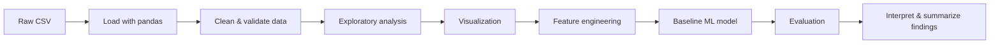
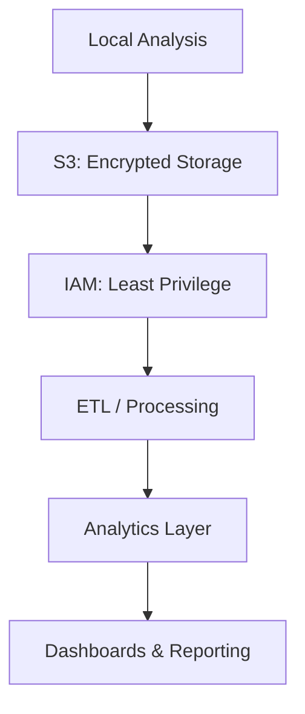

# Healthcare Data Analytics Starter Project (Purdue Global Prep)

A beginner-friendly, end-to-end data analytics project using a healthcare-themed dataset to practice the core skills used in a Master’s of Applied Data Analytics program—especially Python, pandas, visualization, and introductory machine learning.

This repository is intentionally designed to **reduce anxiety and build confidence** by walking through the same workflows that appear repeatedly in graduate coursework and real-world analytics roles.

---

## Project Goals

### Primary Goals (Comfort & Fundamentals)
- Build confidence with:
  - **Python**
  - **pandas** (loading, cleaning, transforming data)
  - **matplotlib / seaborn** (exploratory and explanatory visualizations)
  - **scikit-learn** (baseline models and evaluation)
- Develop analyst thinking:
  - Translate questions → analysis → results
  - Understand what charts and models *actually* say
  - Identify data quality and assumption risks

### Secondary Goals (Professional Readiness)
- Practice structuring a clean GitHub repository
- Learn to document assumptions and decisions
- Produce work that could later evolve into a portfolio project
- Create repeatable patterns useful for health sciences and computational biology work

### Security & Compliance Mindset (AWS Cloud Security Tie-In)
Although this dataset is public and non-sensitive, the project reinforces habits that matter in healthcare analytics:
- Treat data as if it could contain PHI
- Avoid secrets in code or repositories
- Understand encryption-at-rest and encryption-in-transit concepts
- Think in terms of least privilege and data governance

---

## Dataset

- **Source:** Kaggle  
- **File:** `data/healthcare_data.csv`

Typical columns may include:
- Patient demographics (age, gender)
- Administrative info (department, diagnosis, treatment)
- Dates (admission, discharge)
- Financials (bill_amount)
- Status/outcomes

> Assumption: Data is healthcare-like and should be handled cautiously even if synthetic.

---

## High-Level Workflow



---

## Repository Structure (Suggested)

```text
.
├── data/
│   └── healthcare_data.csv
├── notebooks/
│   ├── 01_load_and_sanity_checks.ipynb
│   ├── 02_cleaning_and_features.ipynb
│   ├── 03_eda_and_visuals.ipynb
│   ├── 04_baseline_modeling.ipynb
│   └── 05_storytelling_summary.ipynb
├── src/
│   ├── data_prep.py
│   ├── features.py
│   ├── modeling.py
│   └── viz.py
├── outputs/
│   ├── figures/
│   └── models/
├── requirements.txt
├── .gitignore
└── README.md
```

Notebooks come first; reusable logic can later be migrated into `src/`.

---

## Environment Setup

### Create a virtual environment
**Windows**
```bash
python -m venv .venv
.venv\Scripts\Activate.ps1
```

**macOS / Linux**
```bash
python -m venv .venv
source .venv/bin/activate
```

### Install dependencies
```bash
pip install -r requirements.txt
```

### Launch notebooks
```bash
jupyter lab
```

---

## Suggested Dependencies

```text
pandas
numpy
matplotlib
seaborn
scikit-learn
jupyterlab
python-dateutil
```

Keep dependencies minimal at first—complexity can come later.

---

## Learning Path (Notebook-by-Notebook)

### 01 — Load & Sanity Checks
Focus:
- Reading CSVs
- Inspecting structure and data types
- Identifying missing or suspicious values

Deliverable:
- Written observations on data quality and initial hypotheses

---

### 02 — Cleaning & Feature Engineering
Focus:
- Converting date columns
- Handling categorical variables
- Creating derived features (e.g., length of stay)

Deliverable:
- A cleaned dataset ready for analysis and modeling

---

### 03 — Exploratory Data Analysis & Visualization
Focus:
- Grouping and aggregation
- Distributions, comparisons, and outliers
- Telling a story with plots

Example questions:
- Which departments have the highest average bill?
- Do certain diagnoses correlate with longer stays?
- How does cost vary by department?

Deliverable:
- 6–10 plots with short written interpretations

---

### 04 — Baseline Modeling
Choose **one** task:

**Regression**
- Predict `bill_amount`

**Classification**
- Predict patient `status`

Focus:
- Train/test split
- Basic preprocessing
- Simple baseline models
- Evaluation metrics

Deliverable:
- One trained baseline model and honest performance assessment

---

### 05 — Storytelling & Summary
Focus:
- Translating analysis into clear narrative
- Explaining findings to a non-technical audience

Deliverable:
- A concise written summary of results, limitations, and next steps

---

## Quality Guardrails

- Prefer clarity over complexity
- Every plot answers a specific question
- Every model includes:
  - Baseline comparison
  - Evaluation metric
  - Plain-English interpretation
- It’s okay (expected!) if results are imperfect

---

## AWS / Cloud Context (Conceptual)



This mirrors how similar workflows operate in real healthcare analytics environments.

---

## Future Enhancements

- Add a data dictionary
- Export cleaned datasets and figures
- Add simple model documentation (“model card”)
- Introduce cloud-based storage or analytics (optional)
- Add basic tests or validation checks

---

## Why This Project Exists

This project is about **confidence, repetition, and clarity**.

If you can comfortably:
**load data → clean it → visualize it → build a baseline model → explain results**,  
you are well-prepared for graduate-level analytics coursework and real-world applications in health sciences.